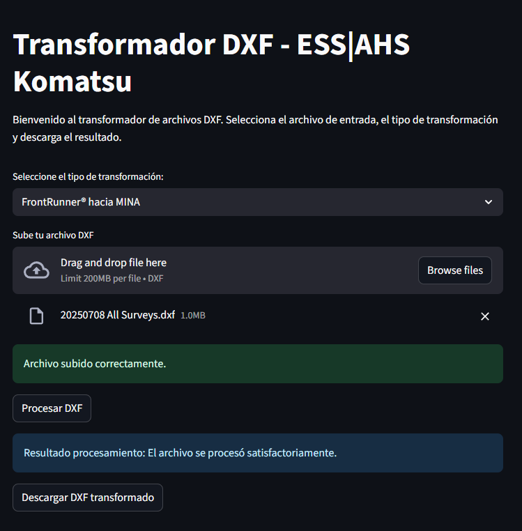
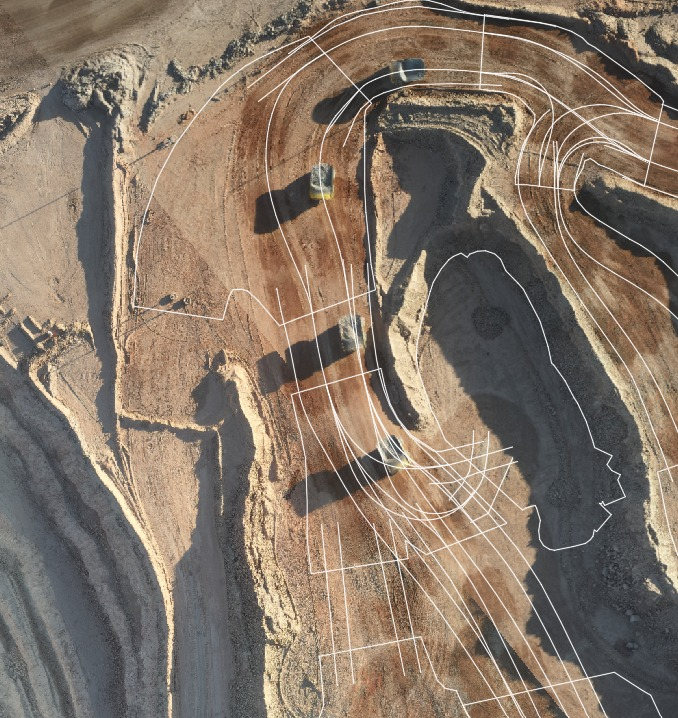

# Transformador DXF - ESS|AHS Komatsu

Este repositorio contiene el código fuente de la aplicación para transformar archivos DXF entre sistemas de coordenadas **FrontRunner®** y **MINA**.
Permite cargar dxf transformado encima de los ortomosaicos de la mina.

> La aplicación está disponible para uso público en AWS.

---

## 📋 Características principales

- Subida y procesamiento de archivos DXF vía interfaz web.
- Transformaciones geográficas: FrontRunner® ↔ MINA.
- Descarga rápida del archivo DXF transformado.
- Interfaz moderna y fácil de usar gracias a Streamlit.

---

## 🖥️ Capturas de pantalla

| Interfaz de usuario | Ejemplo de resultado final |
|---------------------|--------------------------|
|  |  |

- `assets/interfaz.png`: Imagen de la interfaz principal.
- `assets/resultado.png`: Imagen mostrando un ejemplo de resultado final.

---

## 🌐 Uso público de la aplicación

La aplicación está desplegada y disponible para uso público en la nube de AWS.  
Puedes acceder y utilizar la app a través de la siguiente URL:

**[Enlace a la app en AWS](http://ec2-18-222-200-4.us-east-2.compute.amazonaws.com:8501/)**

---

## 👨‍💻 Autor

- [Tito Ruiz, Ingeniero Geomensor - Est. Magister Informatica](https://github.com/titoruizh)

---

